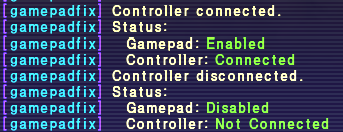

# gamepadfix v1.1.2

Turns the gamepad setting off when no controller is connected, and back on when one arrives.

FFXI can hitch when that setting is on with nothing plugged in. There is nothing to set up and nothing to configure.

## Install

1. Put the `gamepadfix` folder into your `Game/addons/` folder.
2. Type `/addon load gamepadfix` in game.

To load it automatically every time, add it to your default script.

## Commands

`/gamepadfix` tells you whether a controller is connected and whether the gamepad setting is on.

`/gamepadfix debug` prints everything the addon can see about your controllers, for when something is not behaving and you want to report it.

## Good to know

- Works with Xbox and PlayStation controllers, wired or wireless, and with most other pads. XInput and DirectInput are both covered, since it asks Windows what a device is rather than going through either one.
- Swap controllers without restarting. Turn one off, turn another on, and the addon follows along.
- It only changes the setting while you play. Nothing is saved and nothing is altered permanently.
- Unload it with `/addon unload gamepadfix` and your gamepad setting goes back to how it was.

## One thing it cannot detect

A PlayStation controller charging over USB while switched off still looks connected to Windows, and there is no way to tell it apart from one that is on and sitting untouched.

Unplug it or turn it on if you want the setting to switch off.

More addons @ https://github.com/AddonsXI
